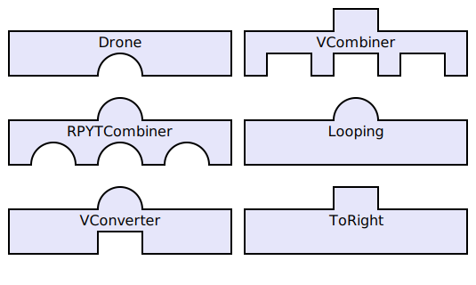
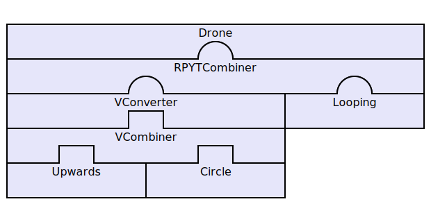
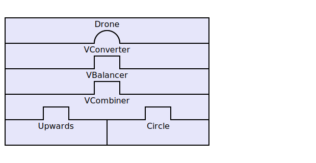

# nameHier-Dokumentation

*nameHier* ist eine Bibliothek zur einfachen Verwendung der *cflib*, einer Bibliothek zur Steuerung der [Crazyflie-Drohne](http://www.bitcraze.se/category/crazyflie/). Sie ist im Zuge eines Projekts im 4. Semester 

## Funktionsweise

*nameHier* ist darauf ausgelegt mehrere Flugbewegungen kombinieren zu können. Diese Bibliothek verwendet ein sogenanntes "Bausteinsystem" und ist *tick-basiert*. Jeden Tick fragt die Drohnen-Verwaltung **Drone** seinen angemeldeten Kindbaustein nach neuen Werten. Dieses Prinzip wird rekursiv durchgeführt. Bausteine ohne Kinder, also **Movements**, berechnen einen neuen Wert anhand ihrer Aufgabe, der Sensorik und der vergangenen Systemzeit seit dem letzten Tick.

### Bausteinprinzip

Jeder Baustein hat genau eine Funktionalität. Man unterscheidet in 4 verschiedene Bausteintypen:

| Typ | Funktion | Kinderanzahl | Vater- gleich Kind-Schnittstelle |
| :--- | :--- | :--: | :--: |
| **Combiner** | Fügt Werte von mehreren Bausteinen zu einem zusammen | n | ja |
| **Balancer** | Verändert den Wert eines Bausteins je nach Sensorik | 1 | ja |
| **Converter** | Wandelt einen Wert in eine andere Schnittstelle um | 1 | nein |
| ***Movement*** | Führt eine Flugbewegung aus | 0 | -/- |

Diese Bausteine können zu einer Baumstruktur zusammengesetzt werden. Entscheidend ist dafür die Schnittstelle von einem Vater nach unten und einem Kind nach oben. 



Die runden Schnittstellen stehen für die [RPYT-Schnittstelle](http://wiki.bitcraze.se/projects:crazyflie:userguide:index#flying), die die Drohne verwendet. Die eckigen für eine mögliche Vektor-Schnittstelle (nicht mitgeliefert) als Beispiel für eine andere Schnittstelle. Genauere Informationen finden sich in dem Abschnitt "Schnittstellen". 

So können die Bausteine miteinander verbunden werden und einen Baum bilden. Die eigentlichen Bewegungen stammt von den **Movements**. Diese können kombiniert und verändert werden und erreichen am Ende die Drohnen-Verwaltungsklasse **Drone**, die den Wert an die Crazyflie übergibt. Die folgenden zwei Beispiele illustrieren die Baumstruktur:





### Schnittstellen

Wie oben bereits angemerkt, hat jeder Baustein genau eine bestimmte Schnittstelle "nach oben" an seinen Vater (mit Ausnahme von **Drone**) und genau eine Schnittstelle mit der er mit seinen Kindern kommuniziert (entfällt bei keinen Kindern; bei n Kindern haben alle die gleiche Schnittstelle).

#### RPYT-Schnittstelle

Die Schnittstelle, mit der **Drone** mit seinen Kindern kommuniziert, ist die RPYT-Schnittstelle. Der Rückgabewert ist ein vierelementiges Python-Tupel, bestehend aus ``(roll, pitch, yaw, thrust)``. *roll*, *pitch* und *yaw* sind Float-Werte [-180,0:180,0] , wobei *roll* im Uhrzeigersinn um die x-Achse dreht - *pitch* vergleichbar im die y-Achse dreht - *yaw* um die z-Achse. 

*thrust* ist eine natürliche Zahl für die ``10000 < thrust < 60000`` gilt.

Zum Beispiel könnte ein Rückgabewert wie folgt aussehen: ``(-20.428, 173.14159265, 0.0, 16583)``.

#### Weitere Schnittstellen

Jeder Benutzer ist frei eigene Schnittstellen zu implementieren und verwenden. Standardmäßig ist allerdings keine weitere in der *nameHier* enthalten.

## Projektstruktur

### Ordnerstruktur

Der Quellcode dieser Bibliothek in folgende Module gegliedert.

```
nameHier
 |-lib
 |  |-cflib
 |  |   (die zu erweiternde cflib mit Unterordnern)
 |  |-__init__.py
 |  \-eventemitter.py
 |-__init__.py
 |-block.py
 |-drone.py
 |-sensor.py
 \-parentrpyt.py
```

#### lib/cflib

Da die *cflib* ziemlich unhandlich zu bedienen ist, umhüllt diese *nameHier* die *cflib*, die die Entwickler der Crazyflie von Bitcraze unter dem Crazyflie-PC-Client [zur Verfügung gestellt](https://bitbucket.org/bitcraze/crazyflie-pc-client/src/d7a119cb77c7/lib/?at=default) haben. 

#### lib/eventemitter.py

Der Event-Emitter stellt die Basisklasse für *Drone*, *Sensor* und *Block* dar und bietet die Möglichkeit, sich bei Events zu registrieren und wieder abzumelden. 

#### block.py

Block bietet die Basisklassen für jeden spezifischen Baustein, den man implementieren möchte. Dieses Modul enthält 3 Klassen:

- Block(EventEmitter)
- Block1(Block)
- BlockN(Block)

##### Block

*Block* besitzt keine Kinder. Die fertigen Bausteine, die **Movements**, berechnen bei jedem Tick aus der Sensorik und der verstrichenen Systemzeit seit dem letzten Tick ihre neue Bewegung und geben dann an ihren Vater über die Schnittstelle den neuen Wert zurück. 

##### Block1

*Block1* besitzt ein Kind. Es implementiert zusätzlich noch die Möglichkeit ein Kind zu registrieren und es wieder zu entfernen. Bei der Registrierung des Kindes kann dieser Block als Vater sich bei "Ich bin fertig"-Event des Kindes anmelden, um es dann automatisch zu entfernen.

Ein fertiger Block könnte erstens ein **Balancer** sein. Hierbei gleicht die Schnittstelle zum Vater der Schnittstelle zum Kind. Der Wert wird allerdings anhand der Sensorik oder eingebauten Funktionen verändert/angepasst, z.B. *Windausgleicher*, *Werthalbierer* oder *Konstanter-Schub*.

Die andere Möglichkeit ist der **Converter**, der den Wert einer Schnittstelle in eine andere Schnittstelle umrechnet, sodass möglichst eine Rückoperation durchgeführt werden kann und der Sinn des Wertes unverändert bleibt.

##### BlockN

*BlockN* kann mehrere Kinder haben. Einzelne Kinder können registriert werden, die Reihenfolge ist irrelevant. Mit der Angabe des Kindes kann dieses auch wieder entfernt werden. Auch *BlockN* besitzt die Möglichkeit sich zum automatischen Entfernen des Kindes anzumelden. 

Ein **Combiner** kombiniert die Werte mehrerer Kinder zu einem bestimmten Tick und gibt diesen dann an seinen Vater zurück. Es kann je nach *Combiner* aus allen Kindern ein neuer Wert berechnet werden oder nur z.B. der größte Wert ausgewählt werden. Die Aufgabe kann sich unterscheiden und für eine Schnittstelle mehrere *Combiner* geben. Dabei gleichen sich Vater- und Kind-Schnittstelle. Wäre dies nicht der Fall, würde dieser Block mehrere Aufgaben haben und sollte in zwei Teilblöcke aufgeteilt werden.

#### drone.py

Das Modul enthält eine Klasse ``Drone(Block1)``. Wie zu sehen ist *Drone*, die Drohnen-Verwaltung, ebenfalls ein Baustein; jedoch ein ganz spezieller. *Drone* ist der einzige Baustein ohne Vater und sendet beim Tick den Befehl des Kindes nur an die Drohne. Die *Tick*-Routine von *Drone* wird vom Benutzer in häufigen Abständen (meist 10 Millisekunden) direkt aufgerufen.

*Drone* sendet Befehle an die Drohne, erstellt ein Crazyflie- und ein *Sensor*-Objekt und ist der oberste Baustein des Baumes, sozusagen root.

Bei der Initialisierung von *Drone* wird, sofern nicht eigenes übergeben, wird ein neues Objekt der Crazyflie aus der *cflib* und ein *Sensor*-Objekt erstellt.

#### sensor.py

#### parentrpyt.py

### Klassendigramm

### Programmablauf & Benutzung

Im folgenden wird ein beispielhafter Programmablauf beschrieben, was dabei intern geschieht und wie man die einzelnen Teile benutzt.

#### Initalisierung

#### Hinzufügen von Bausteinen

#### Verwendung des Event-Systems

#### Aufrufen von der Tick-Routine

#### Entfernen von Bausteinen

#### Beenden des Programms