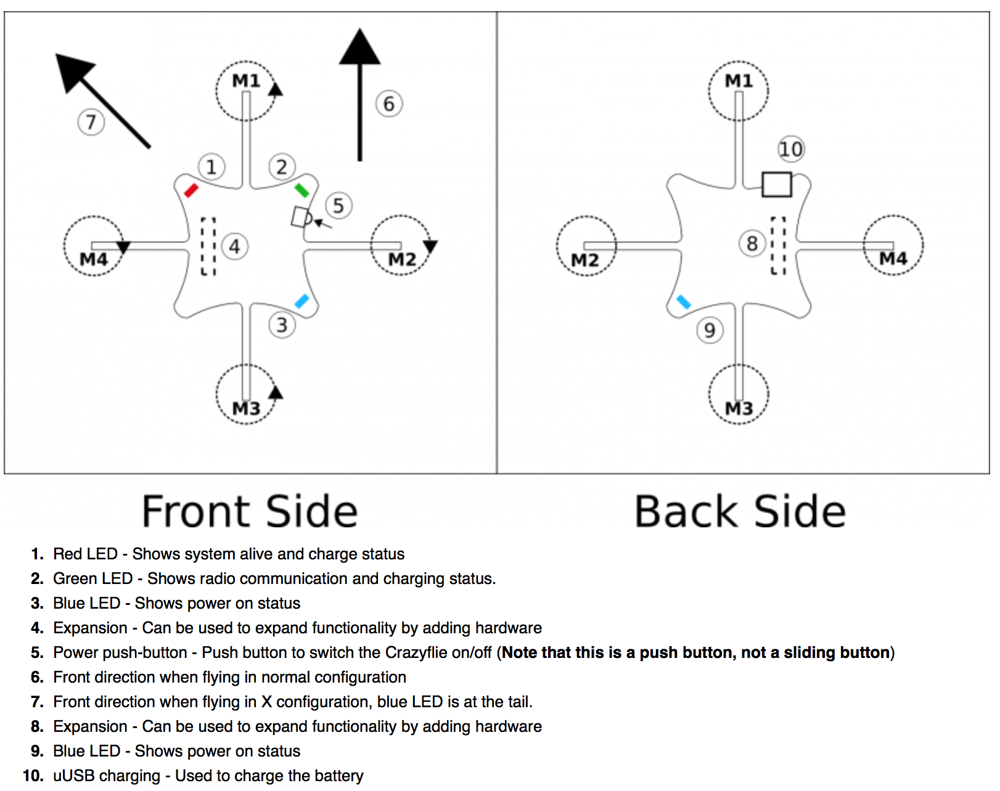
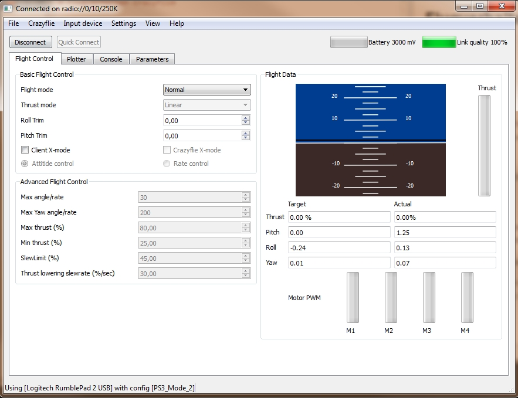
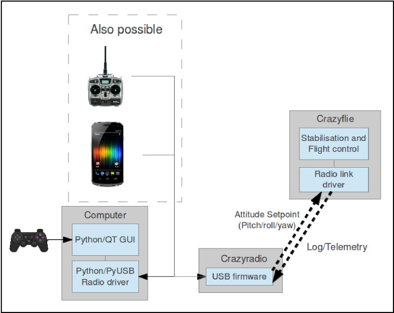
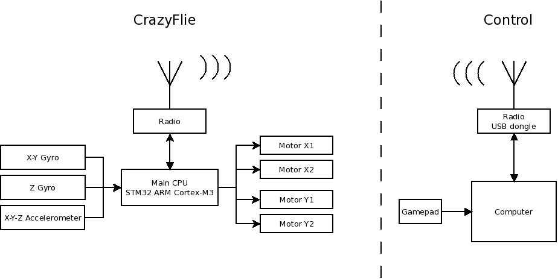

# Crazyflie Flugverhalten

## Drohne 

Die [Crazyflie](http://wiki.bitcraze.se/projects:crazyflie:index) ist ein Quadcopter der von einem [schwedischen Entwicklerteam](http://www.bitcraze.se) als Spaßprojekt geschaffen wurde und soll als Entwicklungsplattform dienen. Die Drohne wiegt nur 9g und hat eine Flugzeit von ca. 7 Minuten. 
Die Crazyflie kann über [Roll, Pitch, Yaw](http://en.wikipedia.org/wiki/Aircraft_principal_axes) gesteuert werden.  

## Elektronik

Die Drohne hat 4 Motoren und mehrere LED´s für die Status-Darstellung. Die Motoren sind mit M1 bis M4 benannt, dabei sind M1 und M3, M2 und M4 Motorenpaare und drehen entweder CCW (M1 u. M3) oder CW (M2 u. M4).  Die Drohne wird per microUSB geladen.

##Client

Der [Client](http://wiki.bitcraze.se/projects:crazyflie:pc_utils:qt_ui) der Crazyflie ist eine ["RTF"](http://en.wikipedia.org/wiki/Ready_to_Fly_(radio_control) GUI die für verschiedene Zwecke benutzt wird, darunter Verbinden mit der Drohne und dem Gamepad, Einstellen von Parametern, Überwachung von LOG-Daten (Pitch, Roll, Yaw, Trust) und Flashen/Updaten der Firmware. Um die Drohne "einfach" zu fliegen reicht die GUI vollkommen aus, jedoch müssen wir für unsere Zwecken eine neue GUI entwickeln. 

Es können Einstellung bezüglich des Flugverhaltens direkt aus der GUI getroffen werden, darunter Begrenzungen für Pitch, Roll, Yaw und Trust. Es gibt noch weitere Einstellmöglichkeiten, die das Fliegen einfacher und sicherer machen.

## Kommunikation

Die Kommunikation zwischen der Drohne und dem HostPC funktioniert über das [Crazyradio](http://wiki.bitcraze.se/projects:crazyradio:index), ein USB-Dongle der als Fernbedienung fungiert. Zwischen der Crazyflie und der Crazyradio werden [Datenpakete](http://wiki.bitcraze.se/projects:crazyflie:pc_utils:qt_ui) hin und her geschickt mit Attitude Setpoint (Pitch, Roll, Yaw) und die Drohne schickt LOG und Telemetry Daten wieder zurück. 
Es muss nicht zwingend ein Computer mit Gamepad verwendet werden, die Crazyflie kann auch über ein [Android-Gerät](http://wiki.bitcraze.se/projects:crazyflie:android_client:dev_guide) oder eine normale Fernbedienung gesteuert werden.

## Sensoren

- 3-Achsen-Gyrometer
   -	Pitch (-90° bis 90°)
   - 	Roll (-90° bis 90°)
   -	Yaw (-180° bis 180°)
- 3-Achsen-Beschleunigungssensor
- 3-Achsen-Magnetometer (Kompass)
- Altimeter

Die Sensoren geben Werte im 0,01-Bereich an, jedoch sind bei solchen kleinen Messwerten die Daten nicht konsistent. Bei dem ruhigen Liegen der Drohne z.B. auf einem Tisch bewegen sich die gemessenen Werte in 0,1er-Bandbreite. Um die Daten aussagekräftig nutzen zu können, müssen wir "Messfehler" herrausfiltern.

## Thrust

Versuche haben ergeben, dass die Crazyflie bei circa 60% des maximalen Thrusts (Schub) stabil in der Luft steht (nicht sinkt, nicht steigt).
Im nächsten Test haben wir das Verhalten der Drohne getestet, wenn wir von dieser zuvor beschreiben Ausgangsposition den Thrust ruckartig auf 0 gesetzt haben. Dabei verlor die Drohne natürlich schnell an Höhe, jedoch bekam sie keine Seitenlage oder drehte sich. Beim Wiedereinschalten der Motoren wurde die Crazyflie wieder "aufgefangen" und stabilisierte sich von selbst.   

## Trimmen
- Roll und Pitch veränderbar (-20° bis 20°) aus Client
- Nullwerte für Roll, Pitch immer gleich
- Reset von Yaw bei Einschalten der Crazyflie
- Reset durch Python (pitch=0, roll=0, yaw=0), macht aber keinen Sinn, da wir den Boden am Boden lassen wollen

## Motorsteuerung

Jeder Motor kann einzelt angesteuert werden und wird von der Main-CPU der Drohne kontrolliert. Die Firmware auf dem Quadcopter hat einen eingebauten Stabilisator, dieser steuert ausgehenend von seiner Neigung die Motoren an und versucht dadurch Flugmanöver zu verbessern.

- Roll: M2 und M4 werden reguliert
- Pitch: M1 und M3 werden reguliert
- Yaw: ein Motorpaar (M1 u. M3; M2 u. M4) dreht schneller als das andere 