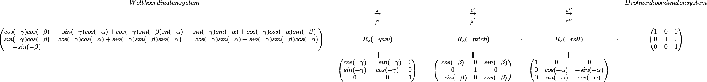

# Drohnenkoordinatensystem

Dieses dokument beschreibt die Umsetzung zwischen
Drohne(-nbewegungsrichtung) und Welt(-bewegungsrichtung).

## Allgemein

Die Drohne ist ein sich frei im Raum bewegendes Objekt, welches sich
auch gekippt um Raum (im folgenden Welt genannt) befindet. Alle Angaben,
die wir zur Drohne über Sensoren erhalten sind relativ zur
Drohnenposition und -neigung. Möchten wir zum Beispiel nun wissen, in
welche Richtung die Drohne sich gerade bewegt, müssen wir den
Geschwindigkeitsvektor (zusammengesetzt aus v\_x, v\_y und v\_z) vom
Drohnenkoordinatensystem in das Weltkoordinatensystem übersetzen.

## Theorie

Nach den Eulerschen Winkeln ergeben sich andere Transformationen, wenn
man andere Winkel zuerst dreht. Die Drohne verwendet ein in der
Fahrzeugtechnig gebräuchliches System des [" z, y', x'' "-Standards](http://de.wikipedia.org/wiki/Eulersche_Winkel#.E2.80.9Ez.2C_y.27.2C_x.27.27-Konvention.E2.80.9C_in_der_Fahrzeugtechnik).
Sie bestet aus einer Neigung um *yaw*, *pitch *und *roll* in deser
Reihenfolge.

## Mathematik

Drehen wir vom Weltkoordinatensystemin dasDrohnenkoordinatensystem
müssen wir folglich zuerst um die z-Achse (z; yaw), dann um die neue
y-Achse (y'; pitch) und dann um die neue-neue x-Achse (x''; roll)
drehen. Um diese Transformation rückgangig durchzuführen, müssen wir x
also wiede zuerst zurück drehen (Messungen rückgängig gerade drehen).
Daraus ergibt sich folgende Matrix.

    <!--
    \begin{matrix} Weltkoordinatensystem &  &  &  &  &  &  & Drohnenkoordinatensystem\   & \overset{z}{\rightarrow} &  & \overset{{y}'}{\rightarrow} &  & \overset{{x}''}{\rightarrow} &  & \   & \overset{z}{\leftarrow} &  & \overset{{y}'}{\leftarrow} &  & \overset{{x}''}{\leftarrow} &  & \  \begin{pmatrix} cos(-\gamma)cos(-\beta) & -sin(-\gamma)cos(-\alpha)+cos(-\gamma)sin(-\beta)sn(-\alpha) & sin(-\gamma)sin(-\alpha)+cos(-\gamma)cos(-\alpha)sin(-\beta)\  sin(-\gamma)cos(-\beta) & cos(-\gamma)cos(-\alpha)+sin(-\gamma)sin(-\beta)sin(-\alpha) & -cos(-\gamma)sin(-\alpha)+sin(-\gamma)sin(-\beta)cos(-\alpha)\  -sin(-\beta) &  &  \end{pmatrix} = & R_{z}(-yaw) & \cdot & R_{z}(-pitch) & \cdot & R_{z}(-roll) & \cdot & \begin{pmatrix} 1 & 0 & 0\  0 & 1 & 0\  0 & 0 & 1 \end{pmatrix}\   & \parallel &  & \parallel &  & \parallel &  & \   & \begin{pmatrix} cos(-\gamma) & -sin(-\gamma) & 0\  sin(-\gamma) & cos(-\gamma) & 0\  0 & 0 & 1 \end{pmatrix} &  & \begin{pmatrix} cos(-\beta) & 0 & sin(-\beta)\  0 & 1 & 0\  -sin(-\beta) & 0 & cos(-\beta) \end{pmatrix} &  & \begin{pmatrix} 1 & 0 & 0\  0 & cos(-\alpha) & -sin(-\alpha)\  0 & sin(-\alpha) & cos(-\alpha) \end{pmatrix} &  &  \end{matrix}
    -->

