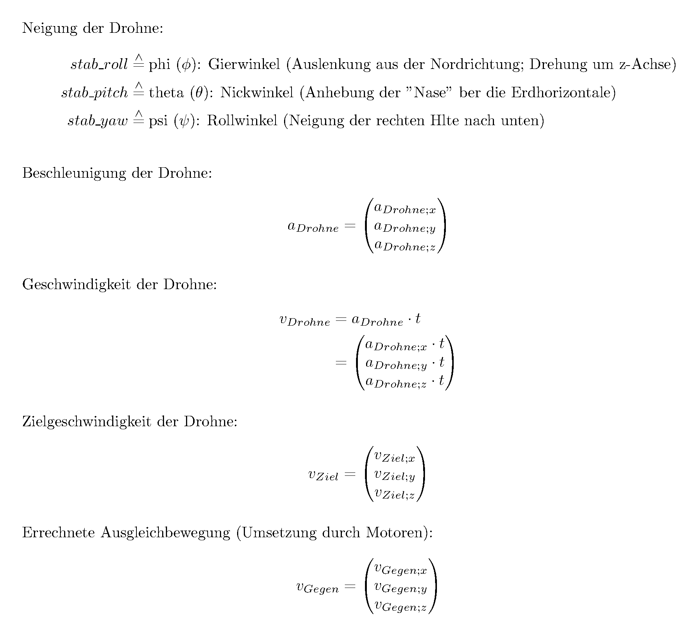
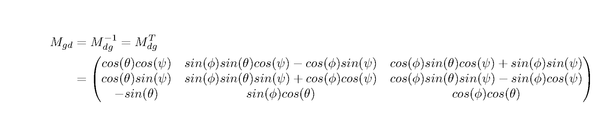
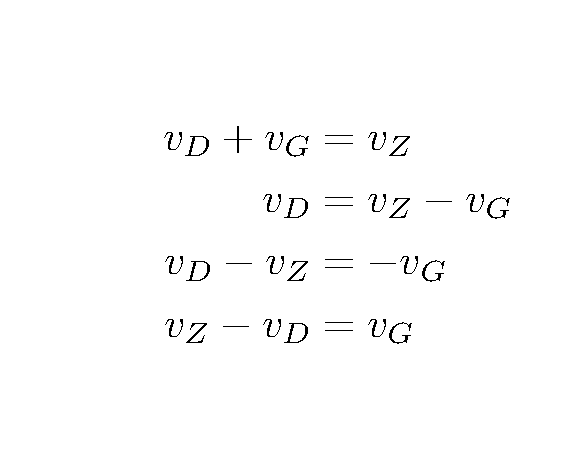

# Hover-Mode

Dieses Dokument beschreibt die theoretische Umsetzung eines Hover-Modes und die Umsetzung zwischen Drohne(-nbewegungsrichtung) und Welt(-bewegungsrichtung).

## Allgemein

### Definition

Der Hover-Mode ist ein Bewegungsmodus, bei dem man sich konstant auf einem Punkt stehen bleibt und sozusagen schwebt. Des weiteren kann man sich, ausgehend von diesem Schwebezustand in verschiedene Richtungen mit veschiedenen, festgelegten Geschwindigkeiten bewegen.

### Startbedingungen

Die Drohne besitzt Beschleunigngssensoren, die ihre Angaben relat zur Neigung der Drohne angeben. Ist die Drohne also  gedreht, geben die Beschleunigungssensoren  die Werte "verdreht" wieder. Gegeben ist also von der **Drohne aus Neigung** und die **Beschleunigung**. Desweiteren nehme ich auch die **"Momentangeschwindigkeit" der Drohne** als Vorrausetung an, siehe unten. 

Die **Zielgeschwindigkeit der Drohne** ist die anzusteuernde Richtgeschwindigkeit absolut im Weltkoordinatensystem. Um diesen (möglichst schnell) zu erreichen, muss mit einer **Gegenbewegung** ausgeglichen werden.

### Funktionsweise

Wir nehmen die aktuelle Geschwindigkeit der Drohne und transformieren sie in das Weltkoordinatensystem. Nun haben wir den Geschwindigkeitsvektor der Drohne vDrohne, welcher in der unternstehenden Abbildung eingetragen ist.

Zusammen mit dem Zielgeschwindigkeitsvektor vZiel wird im zweiten Schritt die Ausgleichbewegung vGegen bestimmt. 

vGegen im Weltkoordinatensystem wird jetzt mit den Motoren (*roll*, *pitch*, *thrust*; *yaw* nicht benötigt) umgesezt.

## 1. Schritt: Drohne zur Welt

Die Drohne ist ein sich frei im Raum bewegendes Objekt, welches sich auch gekippt um Raum (im folgenden Welt genannt) befinden kann. Alle Angaben, die wir zur Drohne über Sensoren erhalten sind relativ zur Drohnenposition und -neigung. Möchten wir zum Beispiel nun wissen, in welche Richtung die Drohne sich gerade bewegt, müssen wir den Geschwindigkeitsvektor (zusammengesetzt aus vDrohne;x, vDrohne;y und vDrohne;z) vom Drohnenkoordinatensystem in das Weltkoordinatensystem übersetzen.

### Theorie

Nach den Eulerschen Winkeln ergeben sich andere Transformationen, wenn man andere Winkel zuerst dreht. Die Drohne verwendet ein in der Fahrzeugtechnik gebräuchliches System des [" z, y', x'' "-Standards](http://de.wikipedia.org/wiki/Eulersche_Winkel#.E2.80.9Ez.2C_y.27.2C_x.27.27-Konvention.E2.80.9C_in_der_Fahrzeugtechnik). Sie besteht aus einer Neigung um *yaw*, *pitch *und *roll* in dieser Reihenfolge.

### Mathematik

Drehen wir vom Weltkoordinatensystem in das  Drohnenkoordinatensystem müssen wir folglich zuerst um die z-Achse (z; yaw), dann um die neue y-Achse (y'; pitch) und dann um die neue-neue x-Achse (x''; roll) drehen. Um diese Transformation rückgängig durchzuführen, müssen wir x also wiede zuerst zurück drehen (Messungen rückgängig gerade drehen). Daraus ergibt sich folgende Matrix (*yaw* entspricht *z*; *pitch* - *y*; *roll* - *x*):

Multipliziert man diese riesige Matrix mit einem Vektor im DKS ehält man diesen Vektor im WKS:

## 2. Schritt: Berechnung der neuen Ausgleichbewegung

Nun haben wir also unsere aktuelle Bewegung der Drohne UND unsere Zielbewegung im Weltkoordinatensystem. Die Ausgleichbewegung muss folglich (wie bei einem Kräfteparallelogramm zusammen mit der aktuellen Bewegung die Zielbewegung sein.

### Berechnung

Daraus ergibt sich folgendes Gleichungssystem:

Die Gegenbewegung ist gleich der Zielbewegung minus die aktuelle Bewegung.

## 3. Schritt: Umsetzung der Gegenbewegung

Die Gegenbewegung vG ist im Weltkoordinatensystem. Um sie sinnoll verwenden zu können, transformieren wir diesen Vektor ins Drohnenkoordinatensystem zurück, um ihn dann in seine Bestandteile aufzuteilen.

### Rücktransformation

Die Rücktransformation findet analog zu Transformation Drohne-Welt.

BERECHNUNGEN HIER EINFÜGEN

Multiplizieren wir die folgende Matrix mit einem Vektor aus dem Weltkoordinatesystem, erhalten wir diesen Vektor im Drohnenkoordinatensystem:

BERECHNUNGEN HIER EINFÜGEN

### Umsetzug in Motren

Nun teilen wir den Vektor in die Bestandteile auf. vG;x übersetzen wir mit zusätzlichem *roll* - wir multipizieren vG;x mit einem Balancefaktor und addiren es zu unserem bisherigem *roll*. Gleiches Prinzip führen wir mit vG;y und *pitch* durch, sowie mit vG;z und *thrust*.

Als Balancefaktor haben wir bisher **noch keine für vG;x und vG;y** ausmachen können. Misst man alle 10ms, bietet sich allerdings **2500 für G;z** an.