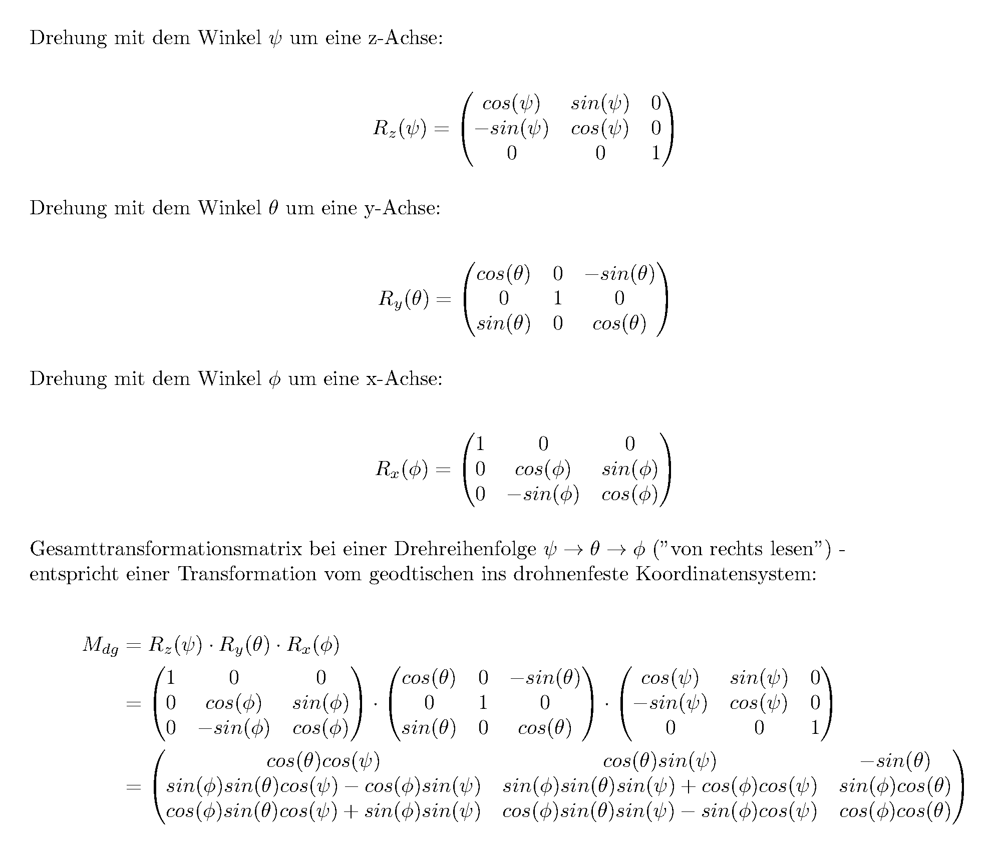

# Hover-Mode

von Sebastian

Dieses Dokument beschreibt die theoretische Umsetzung eines Hover-Modes und die Umsetzung zwischen Drohne(-nbewegungsrichtung) und Welt(-bewegungsrichtung).

## Allgemein

### Definition

Der Hover-Mode ist ein Bewegungsmodus, bei dem man sich konstant auf einem Punkt stehen bleibt und sozusagen schwebt. Des weiteren kann man sich, ausgehend von diesem Schwebezustand in verschiedene Richtungen mit veschiedenen, festgelegten Geschwindigkeiten bewegen.

### Startbedingungen

Die Drohne besitzt Beschleunigngssensoren, die ihre Angaben relat zur Neigung der Drohne angeben. Ist die Drohne also  gedreht, geben die Beschleunigungssensoren  die Werte "verdreht" wieder. Gegeben ist also von der **Drohne aus Neigung** und die **Beschleunigung**. Desweiteren nehme ich auch die **"Momentangeschwindigkeit" der Drohne** als Vorrausetung an, siehe unten. 

Die **Zielgeschwindigkeit der Drohne** ist die anzusteuernde Richtgeschwindigkeit absolut im Weltkoordinatensystem. Um diesen (möglichst schnell) zu erreichen, muss mit einer **Gegenbewegung** ausgeglichen werden.

### Funktionsweise

Wir nehmen die aktuelle Geschwindigkeit der Drohne und transformieren sie in das Weltkoordinatensystem (geogätisches Koordinatensystem). Nun haben wir den Geschwindigkeitsvektor der Drohne vDrohne, welcher in der unternstehenden Abbildung eingetragen ist.

Zusammen mit dem Zielgeschwindigkeitsvektor vZiel wird im zweiten Schritt die Ausgleichbewegung vGegen bestimmt. 

vGegen im geodätischen Koordinatensystem wieder ins drohnenfeste Koordinatensystem transformiert mit den Motoren (*roll*, *pitch*, *thrust*; *yaw* nicht benötigt) umgesezt.

## 1. Schritt: Drohne zur Welt

Die Drohne ist ein sich frei im Raum bewegendes Objekt, welches sich auch gekippt im Raum (im folgenden "*geodatisches Koordinatensystem*" genannt) befinden kann. Alle Angaben, die wir zur Drohne über Sensoren erhalten sind relativ zur Drohnenposition und -neigung (im "*drohnenfesten Koordinatensystem*"). Möchten wir zum Beispiel nun wissen, in welche Richtung die Drohne sich gerade bewegt, müssen wir den Geschwindigkeitsvektor (zusammengesetzt aus vDrohne;x, vDrohne;y und vDrohne;z) vom drohnenfesten Koordinatensystem in das geodätische Koordinatensystem transformieren.

Dabei drehen wir nicht den Vektor, sondern "nur" das Koordinatensystem. 

###  Die Koordinatensysteme

Das ***geodätische Koordinatensystem*** ist, wie der Name verrät, erdfest. Dabei wird normalerweise die **x-Richtung nach Norden** angenommen. Nach der Rechte-Hand-Regel ist dann die **y-Richtung nach Osten** und die **z-Richtung ZUM BODEN**. 

Das ***drohnenfeste Koordinatensystem*** ist an der Drohne  festgemacht und der Ursprung befindet sich im Schwerpunkt des Koordinatensystems. die **x-Achse zeigt nach vorne**, die **y-Achse zeigt nach rechts** und die **z-Achse nach unten**. Wenn die Drohne beispielsweise die "Nase" hochnimmt, bewegt sich also das drohnenfeste Koordinatensystem mit und bei jeder Bewegung wird das drohnenfeste Koordinatensystem mitbewegt. 

### Theorie

Nach den Eulerschen Winkeln ergeben sich andere Transformationen, wenn man andere Winkel zuerst dreht. Die Drohne verwendet ein in der Fahrzeugtechnik gebräuchliches System des [" z, y', x'' "-Standards](http://de.wikipedia.org/wiki/Eulersche_Winkel#.E2.80.9Ez.2C_y.27.2C_x.27.27-Konvention.E2.80.9C_in_der_Fahrzeugtechnik). Sie besteht aus einer Neigung um *yaw*, *pitch *und *roll* in dieser Reihenfolge.

### Mathematik

Die Matrizenmultiplikation ist eine nicht kommutative Gruppe. 

Drehen wir vom geodätischen Koordinatensystem in das drohnenfeste Koordinatensystem müssen wir folglich zuerst um die z-Achse (z; yaw), dann um die neue y-Achse (y'; pitch) und dann um die neue-neue x-Achse (x''; roll) drehen. Dieser Vorgang ist im dritten Schritt genauer erklärt. Ich setze die dort erarbeitete Matrix vorraus, nimm sie erst einmal als korrekt hin.

Die Transformation vom drohnenfesten Koordinatensystem ins geodätische Koordinatensystem ist die entgegengesetzte Transformation zur Rücktransformation. Wir drehen also nicht Gier ~ Nick ~ Roll, sondern -Roll ~ -Nick ~ -Gier. Die zuletzt durchgeführte Transformation machen wir also mit dem negativen Winkel zuerst rückgängig. 

In der Praxis jedoch ist es viel einfacher! Besitzt man eine Transformationsmatrix in eine Richtung, ist die Transformationsmartix in die anderere Richtung die transpornierte Matrix. Es gilt:

Multipliziert man diese riesige Matrix mit einem Vektor im drohnenfesten Koordinatensystem erhält man diesen Vektor im geodätischen Koordinatensystem:

## 2. Schritt: Berechnung der neuen Ausgleichbewegung

Nun haben wir also unsere aktuelle Bewegung der Drohne UND unsere Zielbewegung im Weltkoordinatensystem. Die Ausgleichbewegung muss folglich (wie bei einem Kräfteparallelogramm zusammen mit der aktuellen Bewegung die Zielbewegung sein.

### Berechnung

Daraus ergibt sich folgendes Gleichungssystem:

Die Gegenbewegung ist gleich der Zielbewegung minus die aktuelle Bewegung.

## 3. Schritt: Umsetzung der Gegenbewegung

Die Gegenbewegung vG ist im Weltkoordinatensystem. Um sie sinnoll verwenden zu können, transformieren wir diesen Vektor ins Drohnenkoordinatensystem zurück, um ihn dann in seine Bestandteile aufzuteilen.

### Rücktransformation

Die Rücktransformation ist ähnlich zur Transformation vom drohnenfesten Koordinatensystem ins geodätische Koordinatensystem. Die Transformation Mdg vom geodätischen ins drohnenfesten Koordinatensystem ist über die drei Eulerwinkel definiert:

- psi - Gierwinkel (Auslenkung aus der Nordrichtung; Drehung um z-Achse)
- theta - Nickwinkel (Anhebung der "Nase" über die Erdhorizontale)
- phi - Rollwinkel (Neigung der rechten Hälte nach unten)

Das geodätische Koordinatensystem ist das rote Koordinatensystem, wobei xg Richtung Norden, yg Richtung Osten und zg Richtung Erdmittelpunkt ausgerichtet ist. Um ins drohnenfeste Koordinatensystem zu gelagen, drehen wir zuerst um den Gierwinkel (die roten Winkel; um die zg-Achse mit psi); nun um den Nickwinkel (grün; um die k2-Achse mit dem Winkel theta); dann um den Rollwinkel (blau; um die xf-Achse mit dem Winkel phi).

Multiplizieren wir die folgende Matrix mit einem Vektor aus dem geodätischen Koordinatensystem, erhalten wir diesen Vektor im drohnenfesten Koordinatensystem:

### Umsetzug in Motoren

Nun teilen wir den Vektor in die Bestandteile auf. vd;Gegen;x übersetzen wir mit zusätzlichem *roll*, vd;Gegen;y mit zusätzlichem *pitch*, sowie vd;Gegen;z mit *thrust*.

Für jede einzelne Komponente stellen wir eine mathematische Funktion (z.B. *f(roll)*) auf. Diese Funktion gibt an, bei welcher Geschwindigkeit (z.B. vd;Gegen;x) wir wie viel *roll* bzw. *pitch* bzw. *thrust* zum bisherigen *roll* bzw. *pitch* bzw. *thrust* addieren müssen (natürlich auch negativ).

**Die kontrekten Funktionen sind noch nicht aufgestellt.** Zum bestimmen der drei Funktionen existiert der Plan eine Wertetabelle aufzustellen: Bei welcher Ausgleichgeschwindigkeit *vd;Gegen;...* in eine Richtung müssen wir wie viel in diese Richtung ausgleichen. Dann gilt es eine mathematische Funktion zu finden, die diesen Werten am nächsten kommt.

| *vd;Gegen;x*                          | Ausgleichwinkel *roll*                | vd;Gegen;y*                           | Ausgleichwinkel *pitch*               | vd;Gegen;z*                           | Ausgleichschub *thrust*               |
| -----------------------------------------------: | ------------------------------------: | -----------------------------------------------: | ------------------------------------: | -----------------------------------------------: | ------------------------------------: |
| -1.0                                             |                                       | -1.0                                             |                                       | -1.0                                             |                                       |
| -0.9                                             |                                       | -0.9                                             |                                       | -0.9                                             |                                       |
| -0.8                                             |                                       | -0.8                                             |                                       | -0.8                                             |                                       |
| -0.7                                             |                                       | -0.7                                             |                                       | -0.7                                             |                                       |
| -0.6                                             |                                       | -0.6                                             |                                       | -0.6                                             |                                       |
| -0.5                                             |                                       | -0.5                                             |                                       | -0.5                                             |                                       |
| -0.4                                             |                                       | -0.4                                             |                                       | -0.4                                             |                                       |
| -0.3                                             |                                       | -0.3                                             |                                       | -0.3                                             |                                       |
| -0.2                                             |                                       | -0.2                                             |                                       | -0.2                                             |                                       |
| -0.1                                             |                                       | -0.1                                             |                                       | -0.1                                             |                                       |
|  0.0                                             |                                       |  0.0                                             |                                       |  0.0                                             |                                       |
| +0.1                                             |                                       | +0.1                                             |                                       | +0.1                                             |                                       |
| +0.2                                             |                                       | +0.2                                             |                                       | +0.2                                             |                                       |
| +0.3                                             |                                       | +0.3                                             |                                       | +0.3                                             |                                       |
| +0.4                                             |                                       | +0.4                                             |                                       | +0.4                                             |                                       |
| +0.5                                             |                                       | +0.5                                             |                                       | +0.5                                             |                                       |
| +0.6                                             |                                       | +0.6                                             |                                       | +0.6                                             |                                       |
| +0.7                                             |                                       | +0.7                                             |                                       | +0.7                                             |                                       |
| +0.8                                             |                                       | +0.8                                             |                                       | +0.8                                             |                                       |
| +0.9                                             |                                       | +0.9                                             |                                       | +0.9                                             |                                       |
| +1.0                                             |                                       | +1.0                                             |                                       | +1.0                                             |                                       |