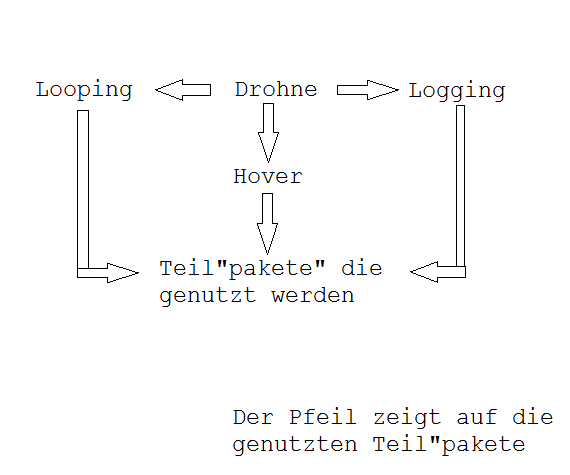
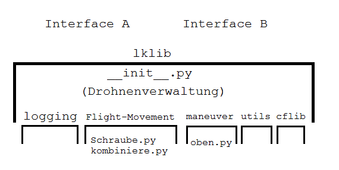
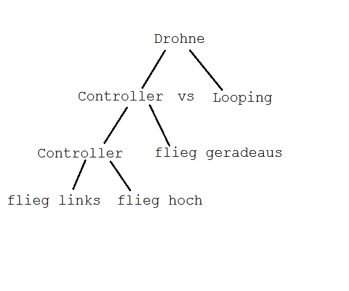

#Stundeprotokoll vom 21.02.14
Stundenleitung: Maxi  
Protokollant: Lukas  
Abwesende: Bjarne, Leon

##Ziel der Stunde:
Erstellung einer Struktur zur Verwaltung von unseren "Paketen" (nicht gleichbedeutend mit Packages)

##Entwürfe:
1)  
  

2)  
  

3)  

Es wurde mehrfach festgestellt, dass die Entwürfe abgesehen davon, dass einige schon mehr in die Implentierung gehen, als andere, gleich sind.  
Demnach werden wir diese Vorschläge nun vermutlich zusammenbringen und das Ergebnis als gesetzt betrachten.

##Plan für die nächste Stunde:
Einigung auf ein tatsächliches Konzept, und genauere Planung dieses Entwurfes.