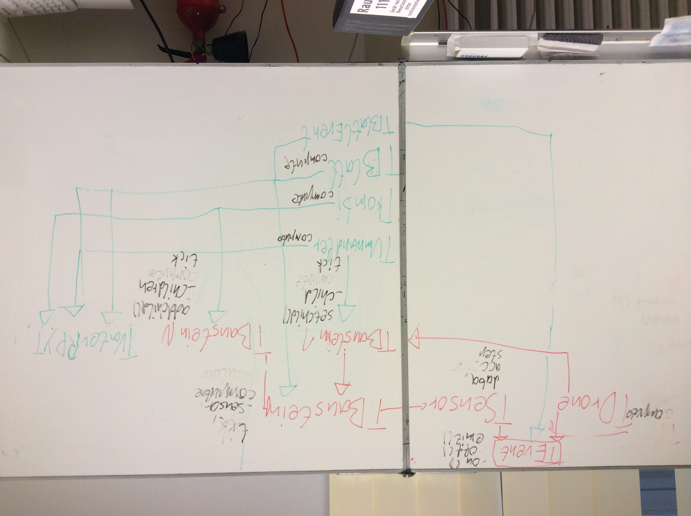

Text vor der Hauptüberschrift.

# Protokoll von dem 18. des Märzes zwanzich vierzehn -- dett war n Dienstach

Jo, ihr Aufschneider! Mit von der Partie waren heute wie immer Luke "the Imperator", Sebbi "the Saw", Leonid Lappen, Maxi *hö* King, Jannis "the practicant/Stundenleiter" und Leon a. k. a. "the Loop/Berichterstatter". Bjarne the Boss und Tobbi Toppsen warn nich am Stissel. 

## Ablauf

### Sensoren

Erstmal freudige Diskussion über den letzten der Programmpunkte, die noch zu klären sind: Nämlich Sensoren und deren Erweiterung. Einigung auf die Version unten rechts mittig auf der Tafel (in rot). Ne, ernsthaft: Das war die Version, die so ausschaut: Ein Dictionary, das bestimmten Eigenschaftswertenbezeichner (in Form von Strings) zugeordnet werden zu den Werten. Also TSensor hat ein Dict-Attribut mySensor.data. Das ein Dict ist. Daher auch Ablehnung des "Verwaltung der Sensor-Klassen-Instanzen über TSensor mithilfe von Liste" und des einigen Kurslern zufolge "2 hoch n Klassen"-Vorschlags. Der wurde von Lukas und Sebastian favorisiert, weil: Die haben ihn ja vorgestellt. Außerdem: Anmerkung von Pragmatiker, die Diskussion sei unnötig, da bei n=1 auch 2^n nicht gerade groß sei.

### Wir schreiben ein Programm, da kannst du prassen. -- Lukas Radke.

Klassendiagramm-SCHLACHT, fortzuseten und to be continued am Freitach. Für die Hutständer unter euch ein Bild: von dem bisherigen Zwischen-Temp-Status pleonastischer Natur.

## Zielsetzung und so

Für nächste Stunde: Logo, Klassendiagramm finieren. Oder auch: "Dann mal ab dafür, ahoi Matrosen und Vollgas voraus! Besser abgedampft und ausgeschieden als reingewürgt und rausgekotzt!" -- Immanuel Kant.